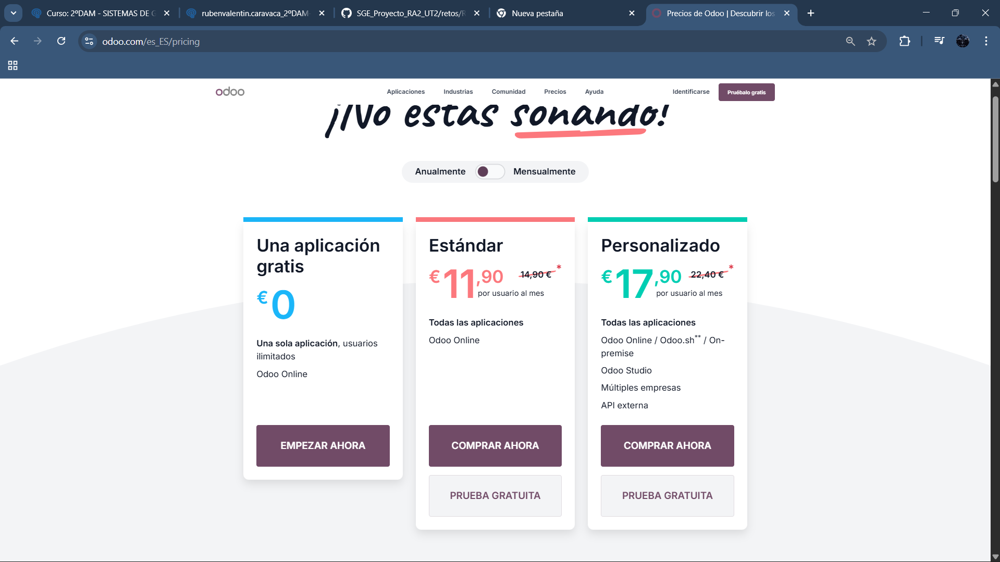
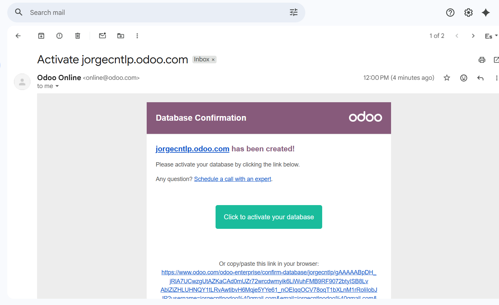
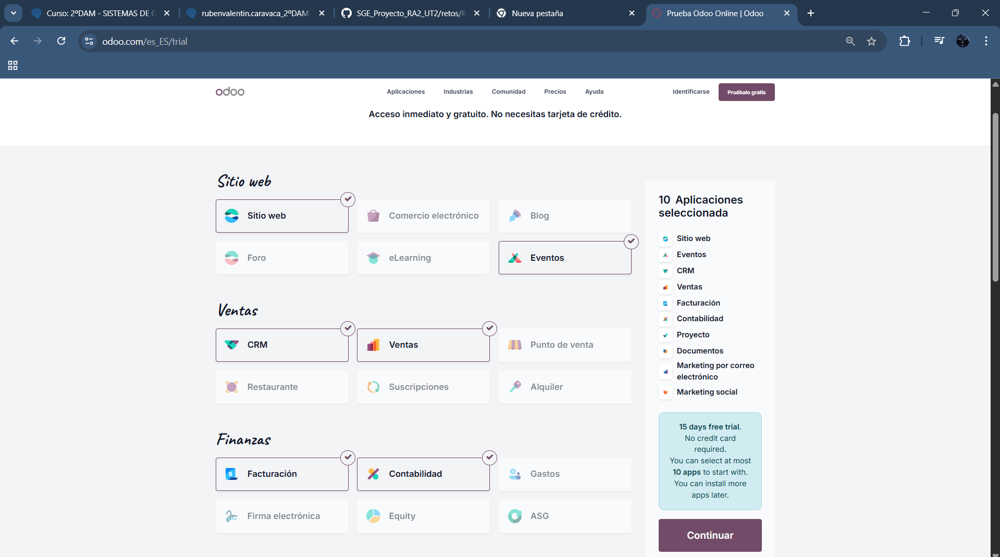
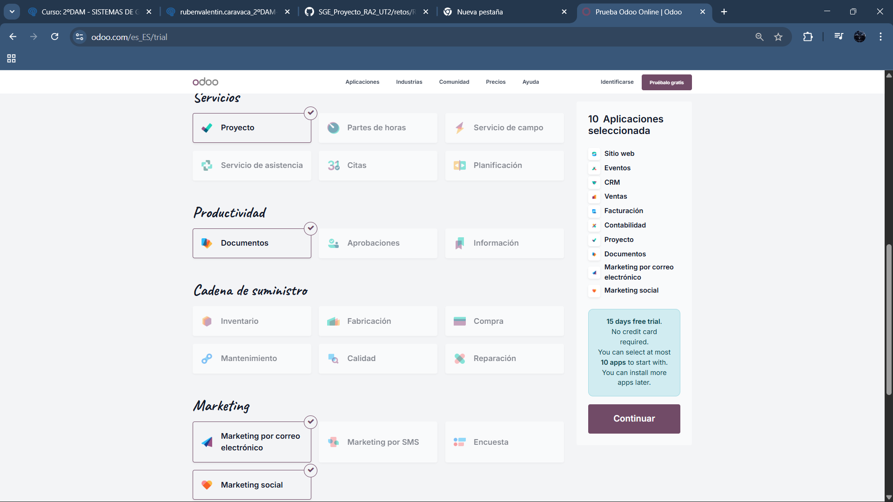
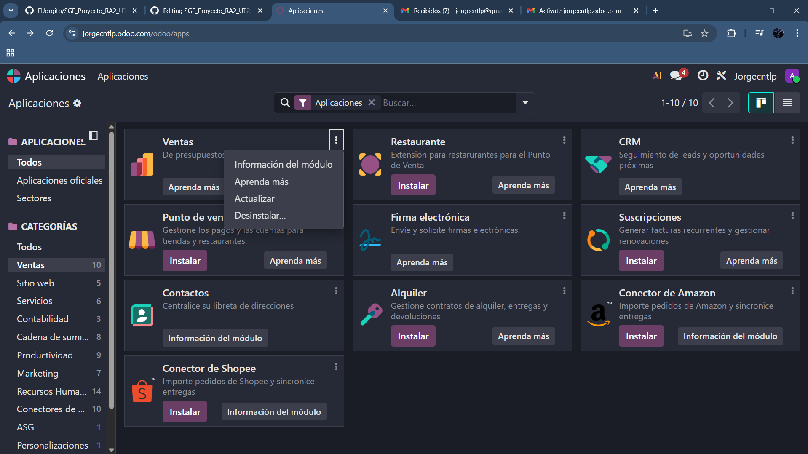
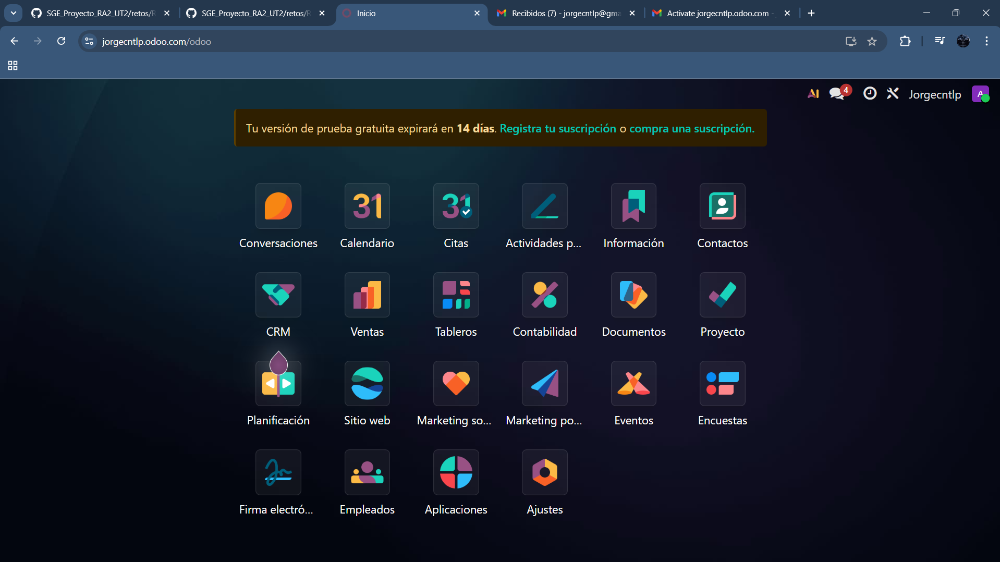

# 03 — Instalación y prueba (15 días) / Alta e instalación de apps

### > En base a las siguentes capturas de pantalla se va a mostrar el proceso de instalación de la versión gratuita de Odoo

## Pasos
# 1. Crear base de datos de prueba (15 días)** desde odoo.com (activar por email).

## > -Vas a la pagina oficial de Odoo y veras este menú (Seleccionas la opcion gratuita del medio)-

## > Tras seleccionar las Apps y meter tus datos personales (saldran justo despues de este paso) tienes que confirmar tu correo para que cree la Base de Datos si no se borra en 3 horas

# 2. Seleccionar apps iniciales** (máximo 10 en la prueba): CRM, Ventas, Facturación, Contabilidad, Proyectos, Documentos, Calendario, etc.

## > Te saldran unas apps a seleccionar en un menú como este

# 3. Instalar/Desinstalar apps** desde *Aplicaciones* (¡cuidado con los datos al desinstalar!).

# Resultado esperado

## > Acceso al panel principal con las apps instaladas.

