# 04 — Ajustes generales
> En este apartado se va a configuray retocar aspestos medianamente importantes de nuestro Odoo

## - Activar **notificaciones** y (opcional) **PWA**.
- Para tener las notificaciones activas, al crearte la cuenta en el menu principal te saldran cuatro mensajes y uno de ellos es para habilitarlas como se muestra a continuación:  
- Tambien se puede instalar una PWA que esta encima de habilitar notificaciones donde pone instalar Odoo para acceder rápidamente a Odoo pero esto es **opcional** para el que quiera.

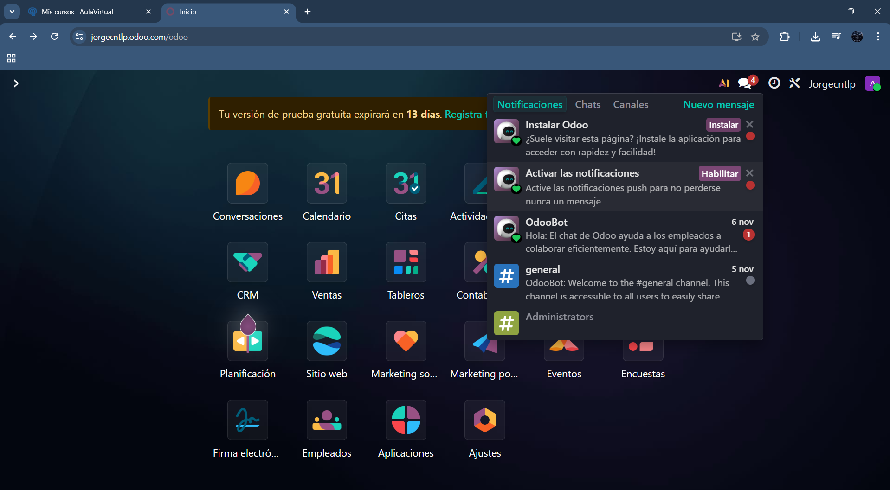

## - Perfil: modo oscuro, datos, **2FA**, firma email, notificaciones en Odoo.
- Para modificar cosas de tu perfil como estas se accede desde el icono de arriba a la derecha y preferencias para los ajustes.

> Se puede cambiar el tema (theme) a modo oscuro, donde recibir las notificaciones si en el e-mail o en Odoo y demas ajustes menores para tu comodidad a la hora de usar la aplicacion
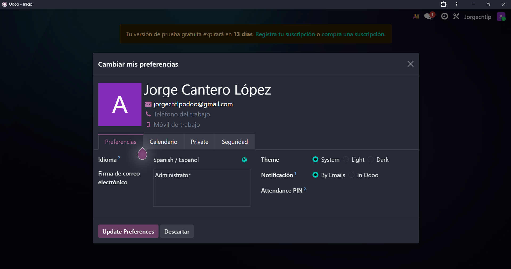

> Se pueden cambiar tus datos personales para que los empleados de tu empresa lo vean 
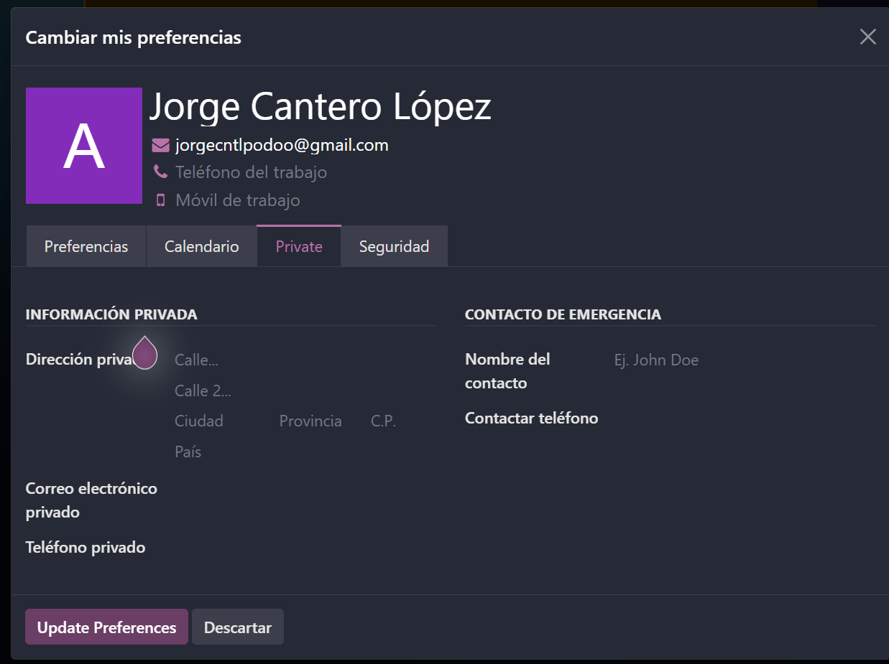

> Se puede cambiar la verificacion a 2FA, verificación en dos pasos en la pestaña de seguridad
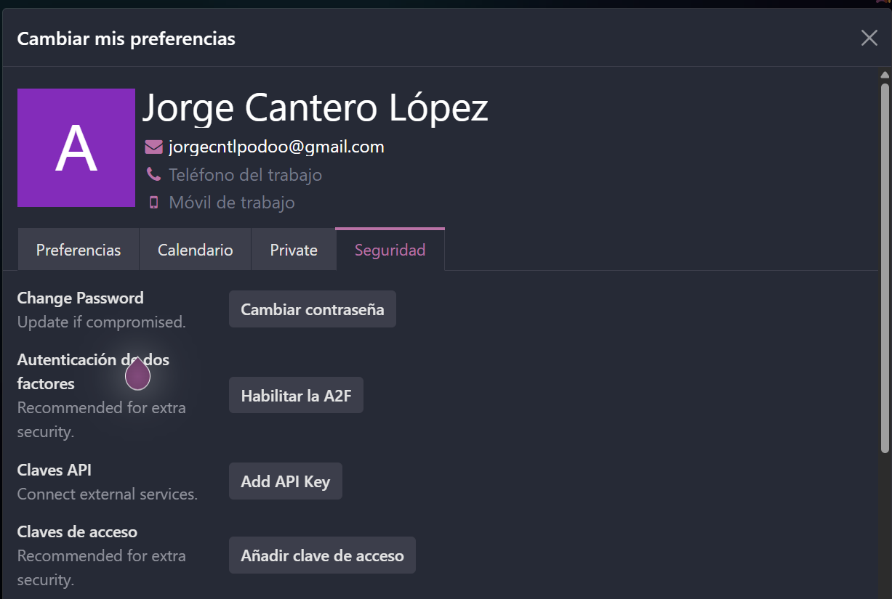

## - **Usuarios y compañías**: roles por módulo; en Enterprise se paga por usuario.
> A continuación se ve en que parte de la aplicacion se pueden gestionar Usuarios y Empresas, para añadir o quitar los dichos y asignar roles a los usuarios y demás privilegios y organización.

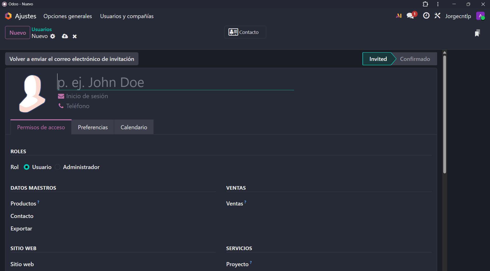
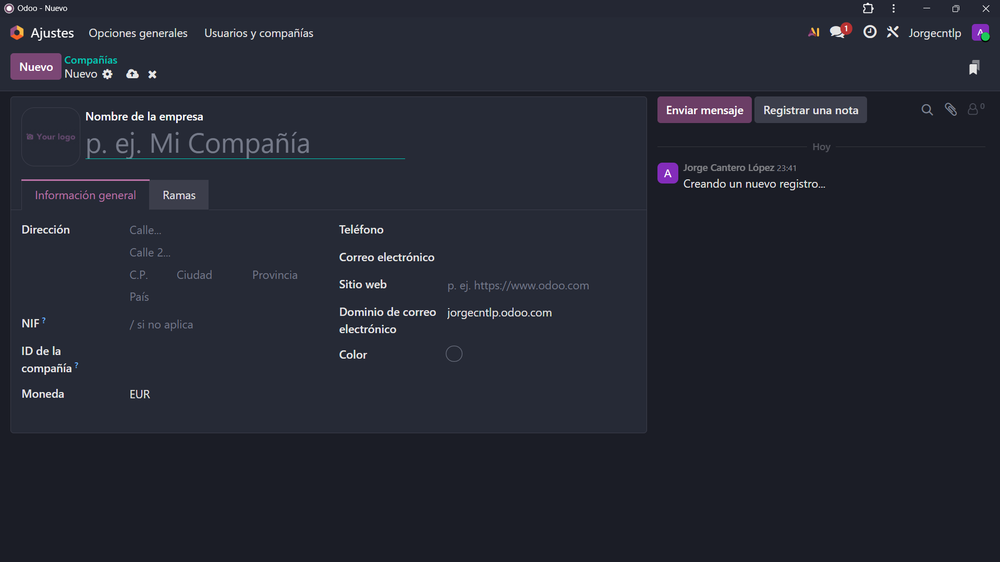

## - **Idiomas** y **diseño de documentos** (plantillas de factura).
> Estas imagenes muestran las opciones de los ajustes generales para cambiar el idioma y la plantilla de los documentos de las facturas.

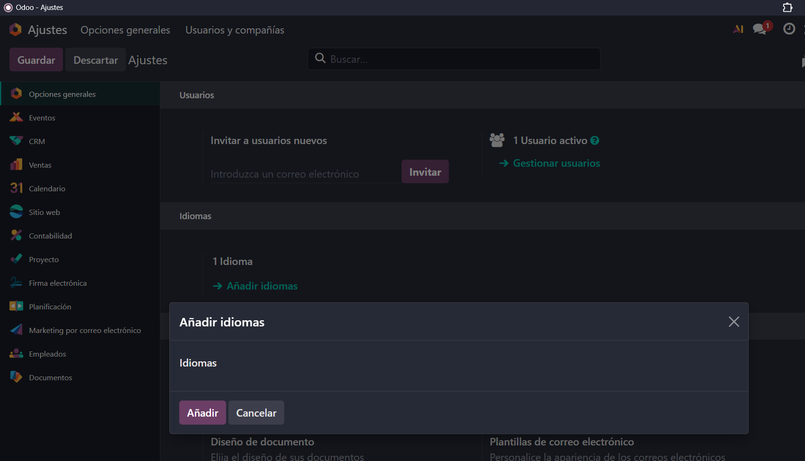
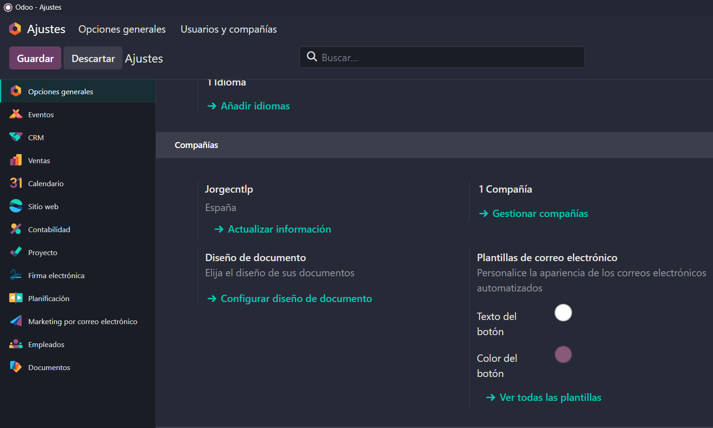
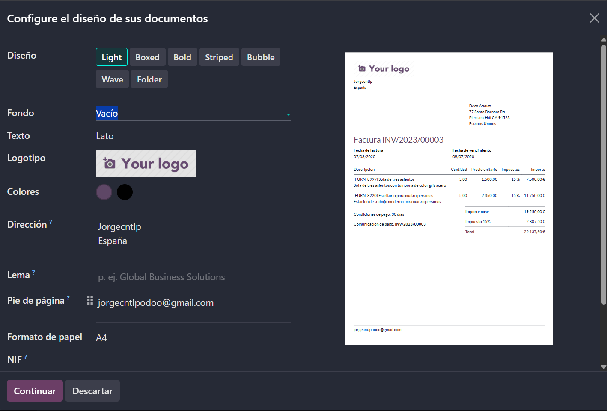

## - **Emails de resumen**: periodicidad y destinatarios.
> Por último se va a mostrar un apartados que se va a detallar mejor luego que es la periodicidad y a que destinatarios les llegan los correos que recopilan el rendimiento de la empresa (se puede cambiar la periodicidad).

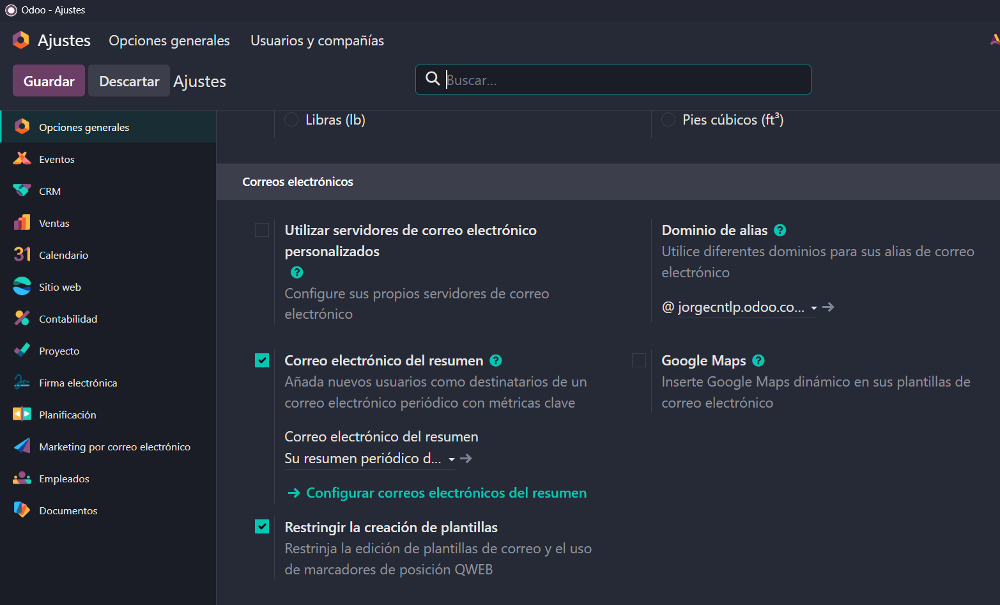

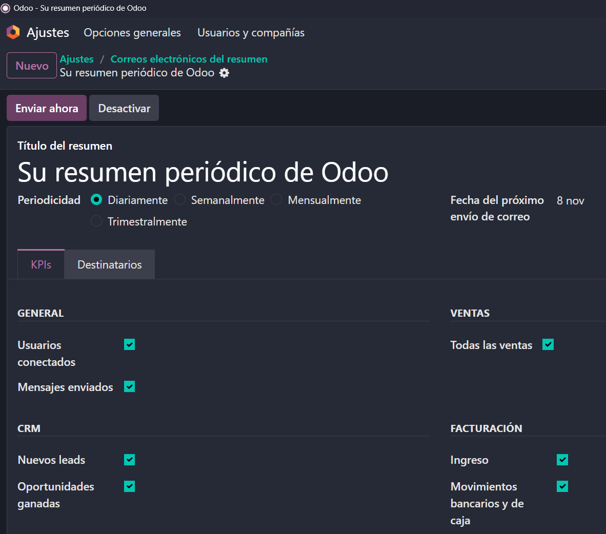