# 05 — Integración con Gmail (OAuth GCP + Add-on)

> En este apartado se va a ver como integrar el gmail con Odoo

## Requisitos
- Cuenta Google Cloud (GCP).

## Pasos resumidos

### 1. **Activar plugin de correo** en Odoo e instalar *Odoo Inbox Add-on* en Gmail.
> Primero tenemos que activar el plugin del correo e los ajustes generales  

> Posteriormente en tu Gmail tienes que instalar Odoo inbox en el simbolo + de la derecha de la pantalla, para tenerlo todo vinculado  
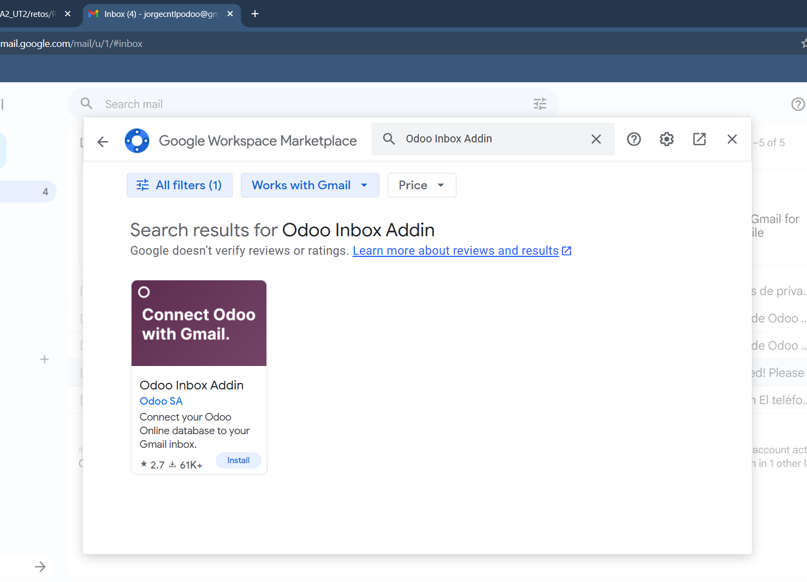

### 2. En **Google Cloud Console**: habilitar *Gmail API*, crear **OAuth Client (Web)**, configurar **redirect URI** de Odoo.
> Primero que nada hay que habilitar otro plugin que es autenticación OAuth, se guarda y se refresca la pagina

> Posteriormente no vamos al navegador de Google y buscamos Google Console y la primera opción. Después le damos a crear un nuevo proyecto
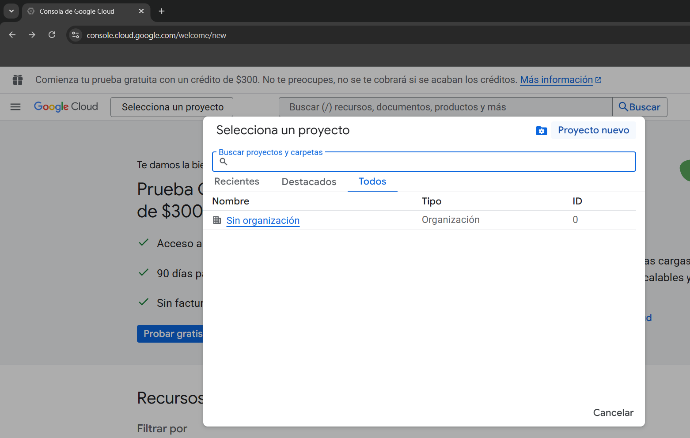
>Y buscamos la API de Gmail y la habilitamos
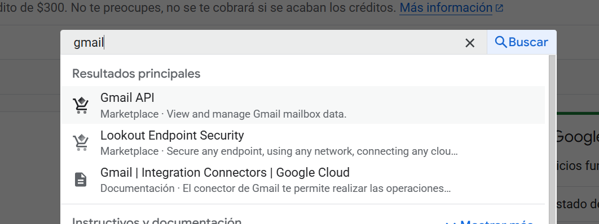

> Luego vamos a crear credenciales en la API
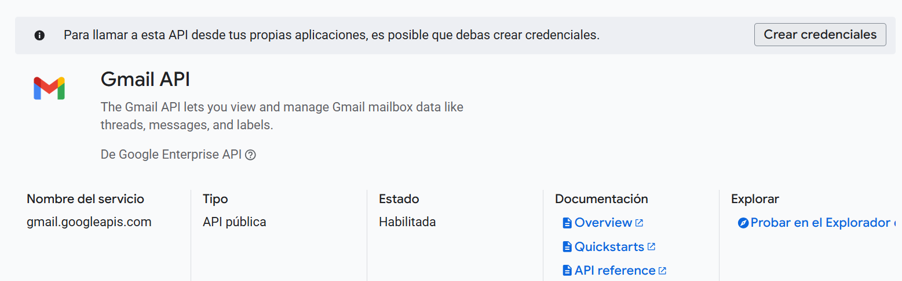
## Hay 5 pasos después de esto
### - 1 Seleccionamos Datos del usuario
### - 2 Ponemos un nombre y el correo electronico
### - 3 Seleccionas los permisos de las imagenes
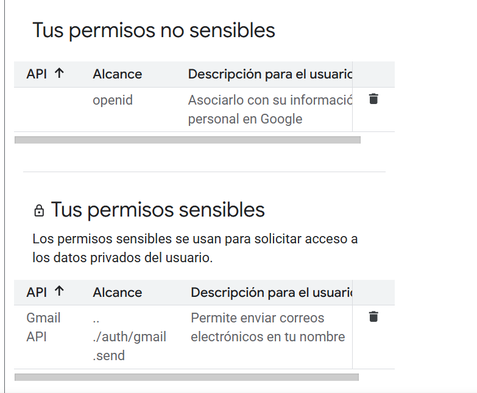
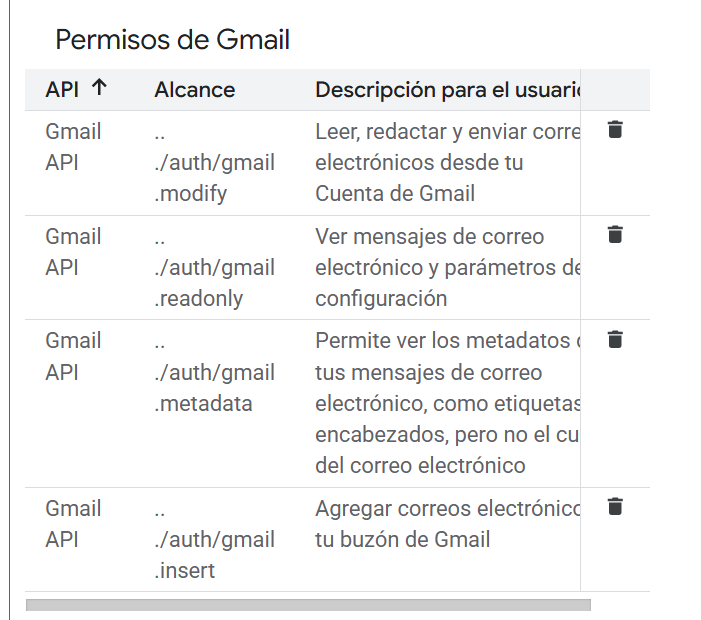
### - 4 El tipo de aplicación será Aplicación Web y añadimos la siguiente URL
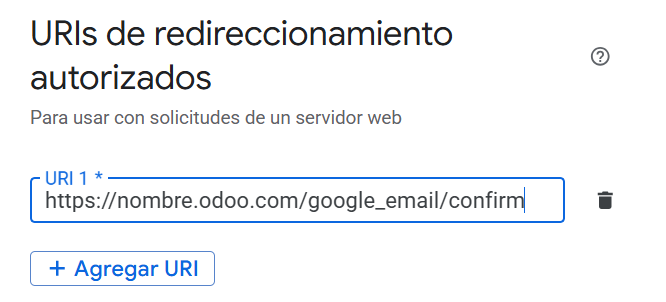
### - 5 Y en credenciales le damos a listo

### 3. Copiar **Client ID/Secret** a Odoo (Gmail server settings) y **Guardar**.
> Después nos vamos credenciales y seleccionamos la que acabamos de hacer, podremos ver el idcliente y el secreto
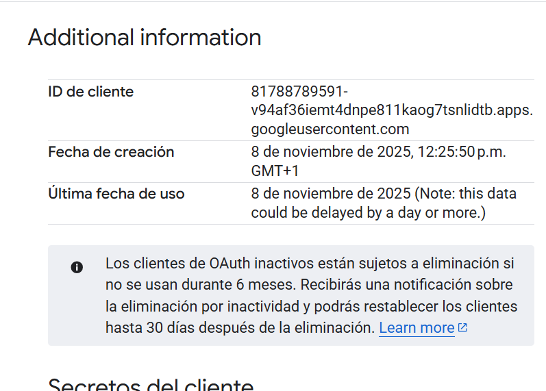
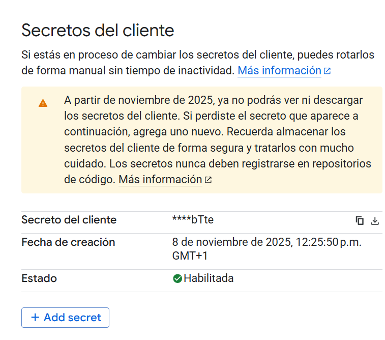

> Copias la idcliente y en la opcion de proveedores que sale justo abajo de autenticación OAuth la pegas
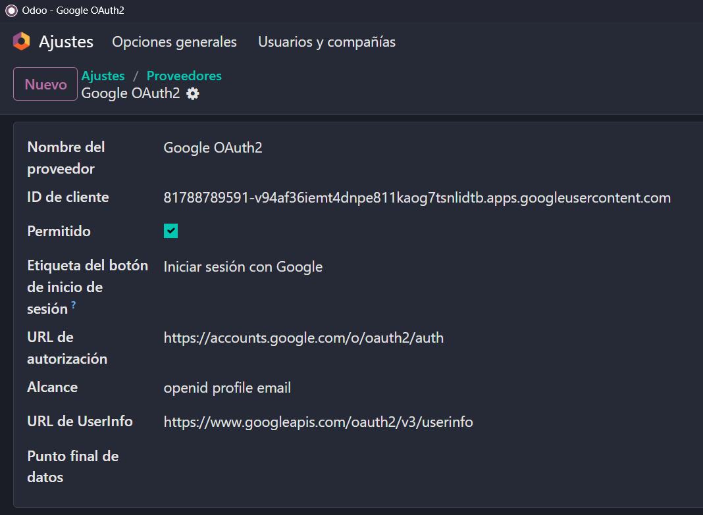

> Por último vamos al apartado de correo electronico en los ajustes generales y le damos a Utilizar servidores de correo electrónico personalizados, piniendo el id y secreto del cliente
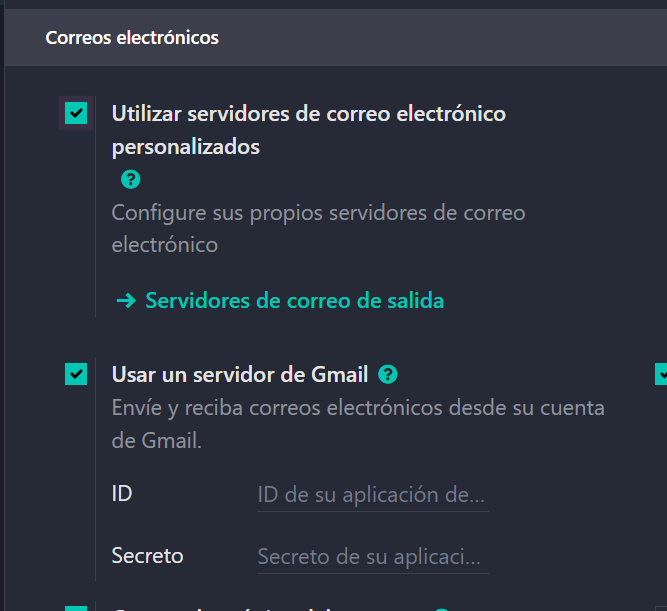

### 4. Probar desde Gmail: crear contacto/oportunidad desde el add-on.

