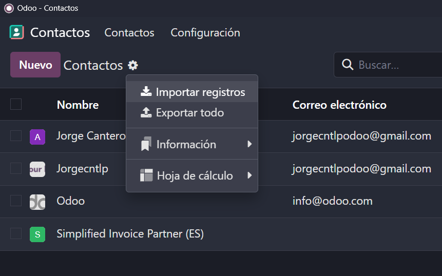

# 06 — Contactos

- Asociación persona/empresa.

- **Etiquetas** para segmentar.

## - Importación CSV (ver `common/ejemplo_csv/`).
> Para importar los contactos que quieres en formato tabla tienes que seleccionarlos en los cuadrados de al lado y seleccionar los campos que quieras en la tabla.

