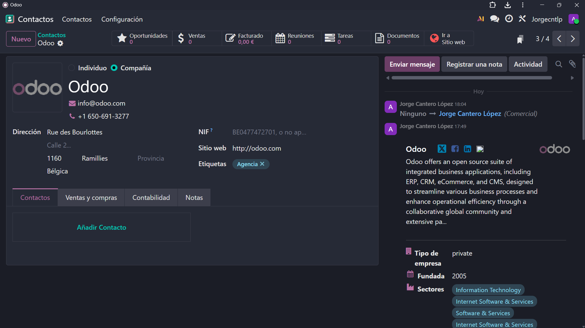

# 06 — Contactos

## Asociación persona/empresa.
> En el apartado de contactos se diferencia automaticamente que son empresas e individuos o empleados  
- En la barra superior hay multiples opciones de gestion referentes a dicho contacto
- En la barra inferior se pueden añadir contactos para que más de uno este enlazado
- En la parte derecha se pueden enviar mensajes, registrar notas y planear actividades para que los contactos a los que sigas y ten sigan vean esos mensajes  

## - Importación CSV (ver `common/ejemplo_csv/`).
> Para importar los contactos que quieres en formato tabla tienes que seleccionarlos en los cuadrados de al lado y seleccionar los campos que quieras en la tabla.
  
# 
