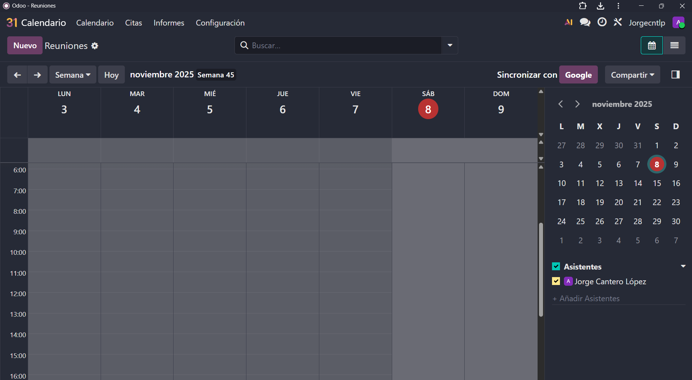
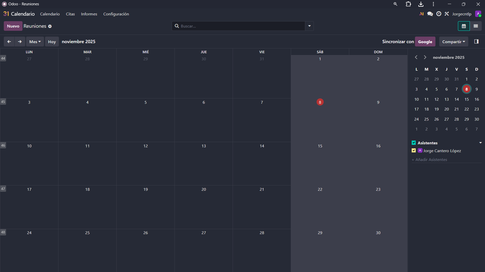
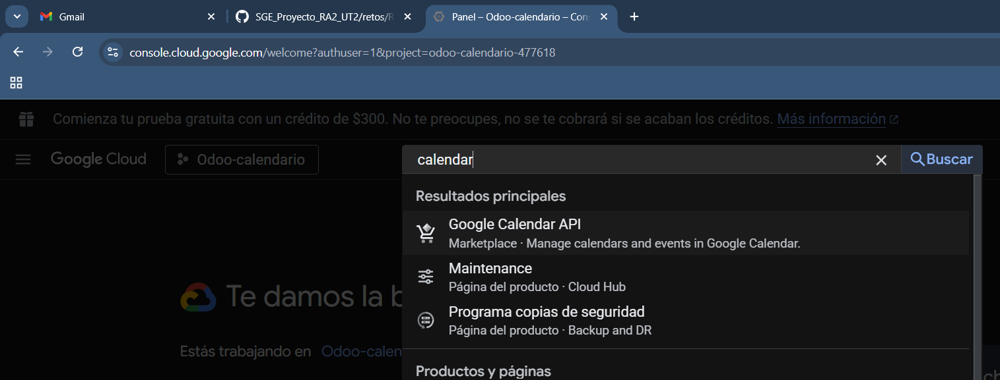
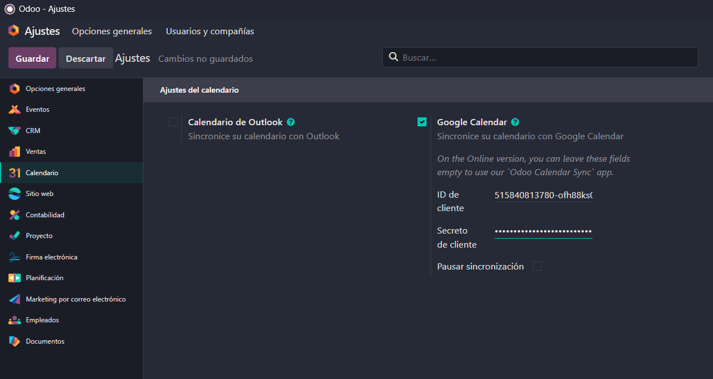
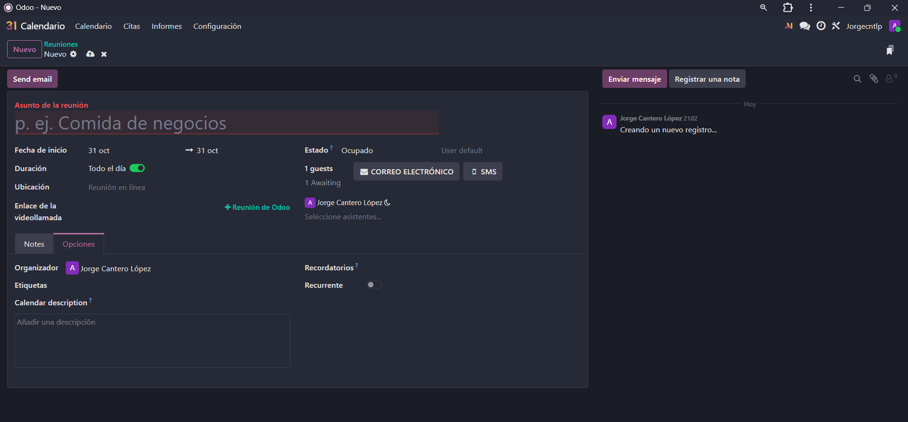

# 07 — Calendario y Citas

> Ahora vamos a ver como configurar el calendario

## - Calendario (día/semana/mes) + disponibilidad del equipo.

## - **Integración con Google Calendar** (API OAuth GCP).
> A hora vamos a ver como integrarlo con el candelario de google en el mismo lugar en el que integramos el correo, creando un nuevo proyecto.
  

> Y lo que tenemos que hacer ahora es habilitar otra API

> Después tenemos que hacer los mismos pasos que con la API del email con los 5 pasos y en agregar o quitar permisos, filtras por Calendario API y seleccionas TODAS  

> Y como dato la URL de redireccionamiento es esta:

> Luego en ajustes metemos la id y el secreto

## - **Odoo Meet** (videollamadas) o enlaces externos.
> A la hora de hacer una videollamada simplemente hacemos click en una fecha del calendario y saldra este menu donde se puede configurar todo la la videollamada y poner el enlace de la misma

## - **Módulo Citas** (Enterprise): enlaces públicos, buffers, preguntas previas.

