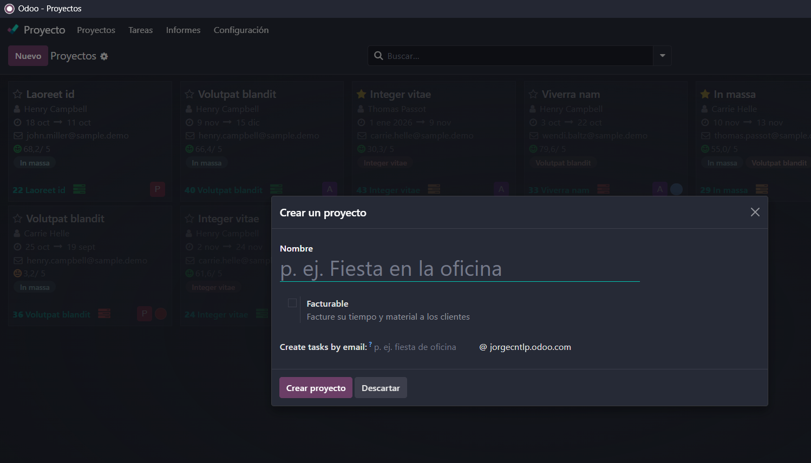
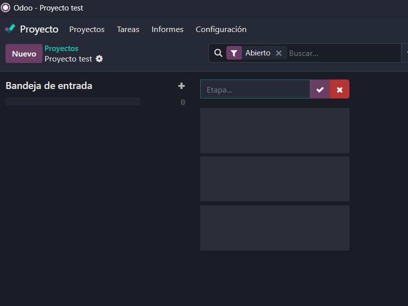
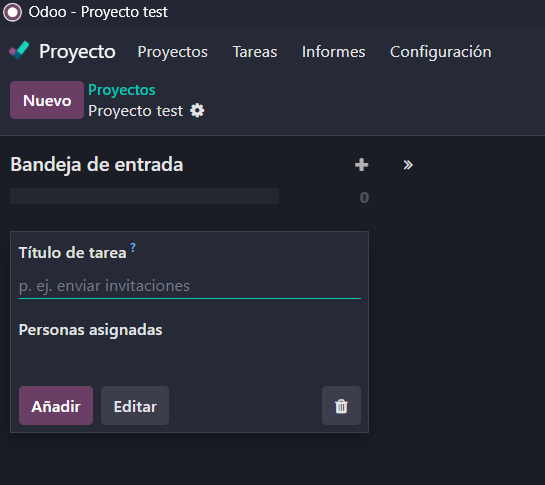
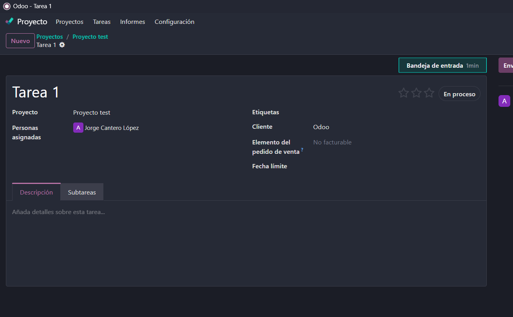
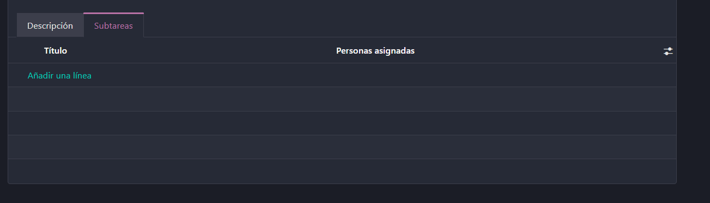
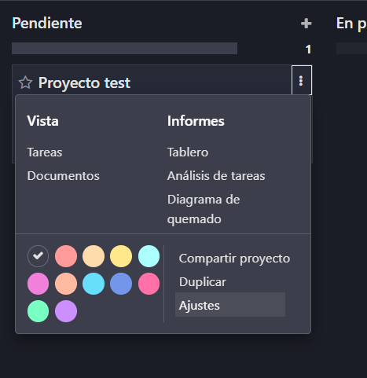
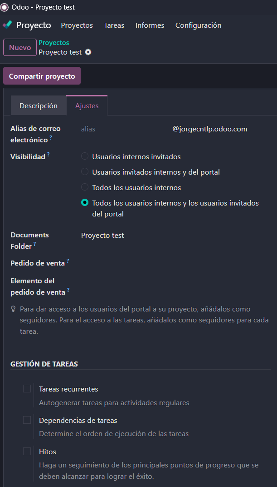
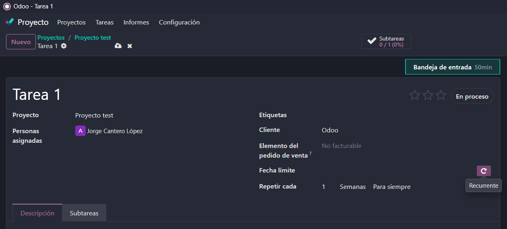
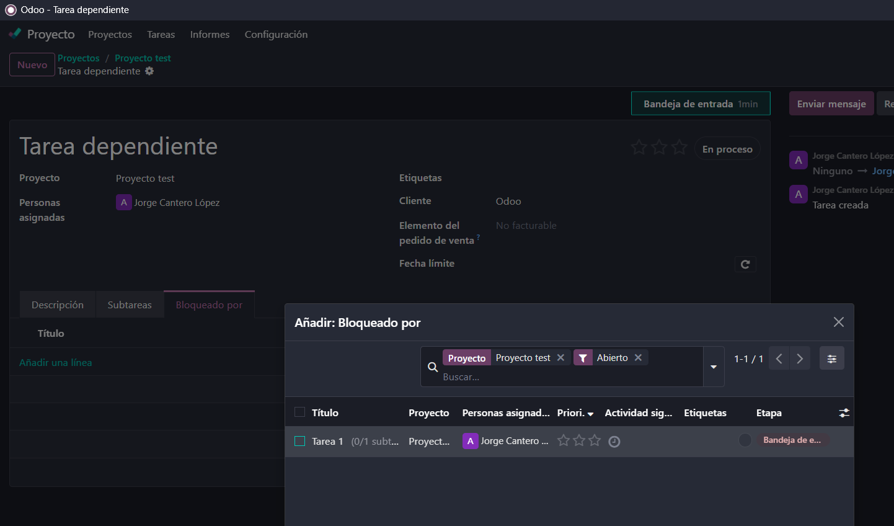

# 08 — Proyectos (Kanban)
> En este apartado vamos a ver el modulo de proyectos
## - Proyectos, etapas, tareas, **subtareas**.
> Para crear un nuevo proyecto al entrar en el modulo y se da a nuevo proyecto
- Se asigna un nombre
- Se puede poner si es facturable
- Se añaden los clientes  

- Dentro de los proyectos se pueden asignar etapas en las que se pueden poner las diferentes partes del proyecto 

- Dentro de cada etapa se pueden asignar tareas y se pueden modificar las tareas

- Se puede modificar clientes
- Fecha
- Personas asignadas
- Si esta en proceso, terminada, etc

- Tambien se pueden crear tareas para dividir y jerarquizar mejor todo dentro de una tarea y a su ver dentro de cada subtarea

## - **Tareas recurrentes**, **dependencias**, **hitos**.
> Ajora en los ajustes dentro de los ajustes del proyecto vamos a seleccionar las tres opciones de gestion de tareas

- La opcion de tarea recurrente ahora se puede activar dandole al icono de la espiral que antes no aparecia para señalar que esa tarea se va a repetir cada X tiempo

- Hay otra opcion que es dependencias de tareas y es basicamente que se puede seleccionar ahora una opcion de bloquer una tarea o tareas si no se han realizado otras antes

- Y por último la opcion de Hitos que es simplemente para recalcar los puntos más importantes que se han realizado de un proyecto
## - Vistas: tarjetas, lista, calendario propio.
>

## - Registro rápido de actividades y **calificación del cliente**.
>

