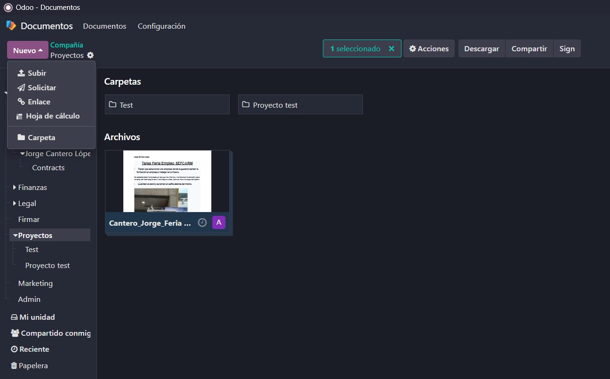
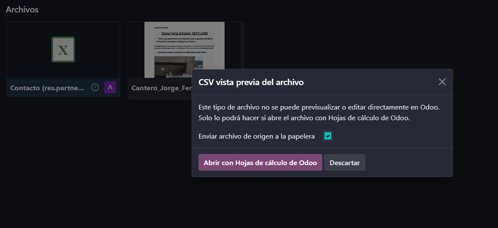
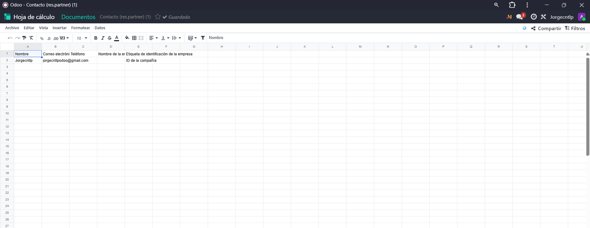
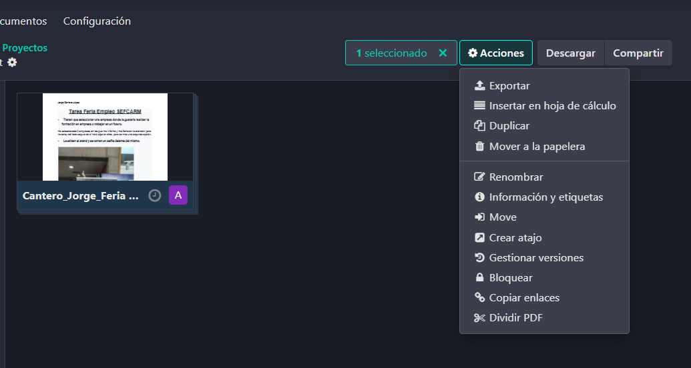
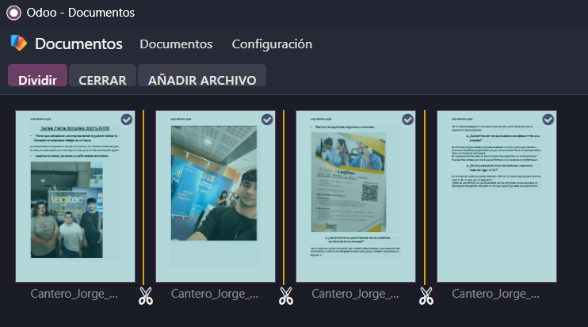
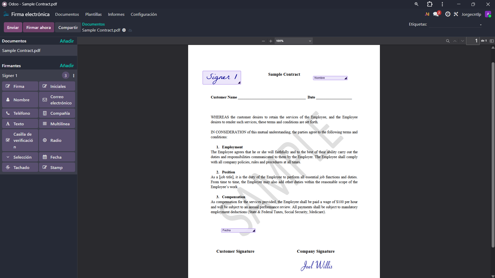
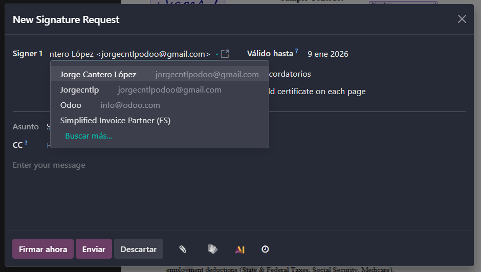

# 09 — Documentos, Firma e Información (Knowledge)

## - **Documentos**: repositorio, edición hojas, dividir PDFs, etiquetas/flujo.
- Nada entrar al modulo de documento se pueden ver todos lo documentos por modulo en la barra derecha y se pueden ver cual corresponde a cada uno

- Tambien Odoo en este modulo puedo modificar las hojas de calculo de forma que cualquiera ve los cambios y puede cambiarlas al ser un archivo compartido del proyecto

- Tambien hay una opcion practica que permite dividir las holas de los PDFs

## - **Firma electrónica**: campos (firma/nombre/fecha), envío y registro.
- Tambien esta el modulo de firma electronica que se puede compenetrar y ser muy util con el modulo de documentos, además de poderse añadir varios campos al documento que vamos a firmar como las opciones de la barra lateral izquierda

- A la hora de enviar los documentos firmados se pueden seleccionar los contacos, hasta cuando es valido, recordatorios, etc

## - **Información (Knowledge)**: wiki tipo Notion, permisos y publicación.

