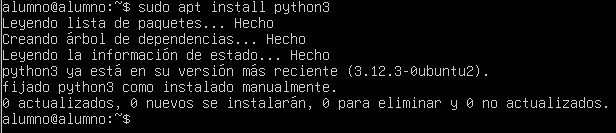
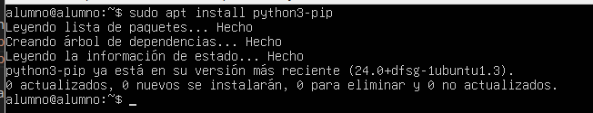
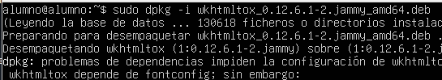
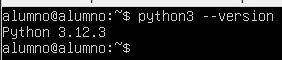

# 05 — Dependencias (Python, wkhtmltopdf, librerías)

1. Instala Python y paquetes de compilación:
Si se esta trabajando en un servidor DE Ubuntu (como es mi caso) Python viene ya de por si instalado asi que no hace falta instalarlo, si trabajas en un sitio que no lo tiene o solo quieres comprobarlo ejecuta lo siguiente:  
Enlace de fuente: https://www.hostinger.com/es/tutoriales/instalar-python-pip-ubuntu
   ```bash
   sudo apt install python3
   sudo apt install python3-pip (Gestor de paquetes) 
   ```
   
   

2. Instala **wkhtmltopdf** compatible (para reportes PDF).  
Enlace fuente: http://gist.github.com/roydejong/7f36c1ded1dda627eeee9a0b332e9eff  
## Dara un error es normal


> Hay que ejecutar esto  

3. Verifica versiones:
   ```bash
   python3 --version
   wkhtmltopdf --version
   ```
   
   
> Resultado esperado: dependencias instaladas y comprobadas.
