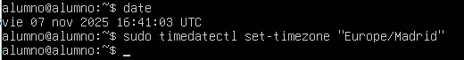
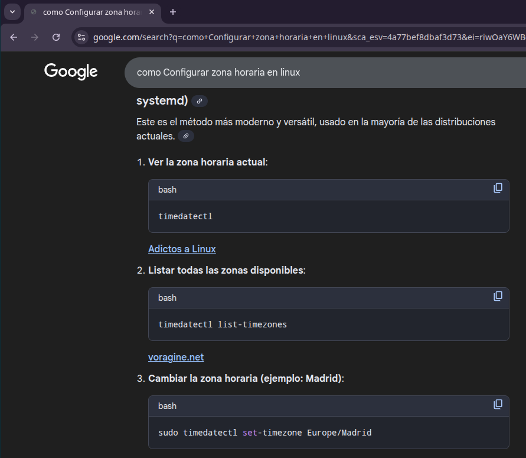

# 03 — Preparación del sistema

1. Actualiza índices y paquetes:
   ```bash
   sudo apt update 
   ```
     

   ```bash
   sudo apt upgrade
   ```
   

2. Configura zona horaria e idioma si procede.

   ```bash
      date
      sudo timedatectl set-timezone "Europe/Madrid"
   ```
   
   


> Resultado esperado: sistema actualizado y listo para instalar dependencias.
